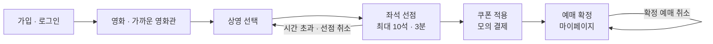

<h1 align="center">CineQueue</h1>

<p align="center"><b>지역 기반 영화관 조회부터 좌석 선점 · 모의 결제 · 쿠폰까지 이어지는 영화 예매 서비스</b></p>

<p align="center">
  
  
  
  
  
  
</p>

<p align="center">
  <a href="#주요-기능">기능</a> ·
  <a href="#요청-흐름">API</a> ·
  <a href="#상태와-잠금">동시성</a> ·
  <a href="#실행">실행 방법</a> ·
  <a href="docs/PRD.md">요구사항 문서</a>
</p>

<hr>

같은 좌석을 여러 요청이 동시에 골라도 예매는 하나만 성공합니다. 선점은 3분이며, 결제 전에 취소하거나 시간이 지나면 좌석이 다시 `AVAILABLE`이 됩니다. 결제는 카드사 연동 없이 상태만 바꾸는 모의 결제입니다.

## 예매 흐름



## 주요 기능

1. 이메일로 가입하고 로그인합니다. 이름, 연령대, 시·도, 시·군·구, 선호 좌석이 저장됩니다.
2. 인기 영화와 오늘·내일 상영 시간표를 봅니다.
3. 내 지역과 가까운 영화관을 거리순으로 보고, 지역과 이름으로 좁힙니다.
4. 한 상영에서 좌석을 최대 10개까지 고릅니다. 고르는 즉시 3분 동안 선점됩니다.
5. 보유 쿠폰을 적용해 결제를 마치면 예매가 확정됩니다.
6. 마이페이지에서 계정, 요금 구분, 회원 등급, 쿠폰, 예매 내역을 확인합니다. 확정된 예매는 취소할 수 있습니다.

회원 등급은 확정 예매 행 수입니다. 좌석을 여러 개 담아도 결제 1번이 예매 1회입니다.

| 확정 예매 | 등급 | 쿠폰 |
| --- | --- | --- |
| 0–2회 | BASIC | 가입 시 1,000원, 1회 |
| 3–5회 | SILVER | 등급 상승 시 2,000원, 1회 |
| 6–19회 | GOLD | 등급 상승 시 3,000원, 1회 |
| 20회 이상 | VIP | 등급 상승 시 5,000원, 1회 |

쿠폰 유효 기간은 30일입니다. 할인액은 그 예매의 결제 금액으로 잘립니다. 예매를 취소해도 이미 발급된 쿠폰은 회수하지 않습니다.

## 요청 흐름

```text
React (Vite :5173)
    │  /api  →  개발 시 Vite 프록시, 배포 시 VITE_API_BASE_URL
    ▼
Spring Boot (:8080)
    │  JWT 필터 → Security
    ▼
MySQL
    영화, 상영, 좌석, 예매, 쿠폰
```

브라우저에 로그인 토큰을 두고, API는 `Authorization: Bearer`로 호출합니다. 세션은 서버에 저장하지 않습니다.

조회 API는 인증 없이 열립니다. 가입, 로그인, 예매, 프로필, 쿠폰은 인증이 필요합니다.

| 메서드 | 경로 | 인증 | 역할 |
| --- | --- | --- | --- |
| `POST` | `/api/users/signup` | 없음 | 가입 |
| `POST` | `/api/users/login` | 없음 | JWT 발급 |
| `GET` | `/api/users/me` | 필요 | 내 정보 |
| `PATCH` | `/api/users/me` | 필요 | 이름, 연령, 지역, 선호 좌석 수정 |
| `GET` | `/api/users/me/coupons` | 필요 | 내 쿠폰 |
| `GET` | `/api/movies` | 없음 | 영화 목록 |
| `GET` | `/api/showtimes` | 없음 | 다가오는 상영 |
| `GET` | `/api/theaters/nearby` | 없음 | 가까운 영화관 |
| `GET` | `/api/theaters/{id}/showtimes` | 없음 | 영화관 상영. 호출 시 시간표 동기화 |
| `GET` | `/api/showtimes/{id}/seats` | 없음 | 좌석 배치 |
| `POST` | `/api/bookings` | 필요 | 선점. `{ showtimeId, seatIds }` |
| `POST` | `/api/bookings/{id}/pay` | 필요 | 모의 결제. 쿠폰은 선택 |
| `DELETE` | `/api/bookings/{id}/hold` | 필요 | 선점 취소 |
| `PATCH` | `/api/bookings/{id}/cancel` | 필요 | 확정 예매 취소 |

예매 API는 토큰의 사용자와 예매 소유자가 같을 때만 통과합니다.

## 상태와 잠금

좌석과 예매는 따로 상태를 가집니다.

| 대상 | 상태 |
| --- | --- |
| 좌석 | `AVAILABLE` → `HOLD` → `RESERVED` |
| 예매 | `HOLD` → `CONFIRMED` / `EXPIRED` / `CANCELLED` |

선점 요청은 좌석 id 순으로 비관적 잠금을 겁니다. 1개에서 10개까지이며, 하나라도 같은 상영의 `AVAILABLE`이 아니면 트랜잭션 전체를 롤백합니다. 결제는 `HOLD`인 예매만 `CONFIRMED`로 바꾸고 연결된 좌석을 `RESERVED`로 바꿉니다. 취소와 만료는 그 예매에 묶인 좌석을 함께 `AVAILABLE`로 되돌립니다.

참고 배치는 예외입니다. 실제 상영 시간을 처음 저장할 때 전체 좌석 수와 남은 좌석 수로 `RESERVED`를 한 번 표시합니다. 이후 새로고침으로 다시 섞지 않고, 선점과 결제만 좌석을 바꿉니다. 예매가 있는 상영은 좌석 수를 다시 만들지 않습니다.

요금은 상영 시각과 관람 연령으로 계산합니다. 금·토·일은 주말, 시작이 10시 이전이면 조조입니다. 유아는 항상 6,000원입니다. `paidPrice`는 결제 시점에 예매 행에 저장되고, 이후 요금 규칙이 바뀌어도 그 금액은 유지됩니다.

| 구분 | 평일 | 주말 |
| --- | --- | --- |
| 성인 일반 | 14,000원 | 15,000원 |
| 청소년 일반 | 12,000원 | 13,000원 |
| 성인 조조 | 10,000원 | 11,000원 |
| 청소년 조조 | 8,000원 | 9,000원 |
| 유아 | 6,000원 | 6,000원 |

가까운 영화관의 거리는 사용자 시·군·구에 있는 영화관 좌표의 평균을 출발점으로 계산합니다. 그 구에 영화관이 없으면 시·도, 그것도 없으면 서울 시청 좌표를 씁니다. 지역 필터와 검색은 화면에서 이미 받은 목록을 거릅니다.

영화 목록은 TMDB, 체인 상영 시간은 공개 시간표 API에서 가져옵니다. 시간표 조회는 쓰기 트랜잭션 밖에서 하고, 상영 한 건의 저장은 별도 트랜잭션입니다. 영화관마다 10분 동안 메모리에 캐시합니다. 응답이 비면 기존 상영은 그대로 둡니다.

## 기술

| 영역 | 기술 | 역할 |
| --- | --- | --- |
| 화면 | React 19, Vite | 단일 페이지. `frontend/src/api.js`가 API 주소를 붙임 |
| 서버 | Spring Boot 4, Java 21 | REST, 검증, 스케줄 |
| 데이터 | MySQL 8, Spring Data JPA | 엔티티와 조회. 로컬은 `ddl-auto: update` |
| 동시성 | `PESSIMISTIC_WRITE` | 좌석, 예매, 쿠폰 행 잠금 |
| 인증 | Spring Security, JWT(jjwt), BCrypt | Stateless. CSRF는 끄고 CORS는 허용 origin만 연다 |
| 외부 호출 | Spring RestClient | TMDB, 영화관 시간표. 연결 4초, 읽기 12초 |
| 실행 | Gradle, Docker Compose | 백엔드 빌드, 로컬 MySQL |

운영 프로파일은 `application-prod.yml`입니다. `SPRING_PROFILES_ACTIVE=prod`이면 `ddl-auto`가 `validate`이고 SQL 로그를 끕니다. CORS 허용 주소는 `APP_CORS_ALLOWED_ORIGINS`입니다.

## 실행

Java 21, Node.js, Docker가 필요합니다.

```bash
cp .env.example .env
```

`.env`에 `DB_PASSWORD`, `JWT_SECRET`, `TMDB_API_READ_ACCESS_TOKEN`을 채웁니다. 이 파일은 Git에 올리지 않습니다. 로컬 Docker MySQL은 `DB_SSL_MODE=DISABLED`입니다. 클라우드 MySQL은 `REQUIRED`입니다.

```bash
docker compose up -d
```

```bash
cd backend
set -a && source ../.env && set +a
./gradlew bootRun
```

`./gradlew bootRun`만 실행하면 `.env`를 읽지 않습니다. 서버는 `http://localhost:8080`입니다.

```bash
cd frontend
npm install
npm run dev
```

화면은 `http://localhost:5173`입니다. `VITE_API_BASE_URL`이 비어 있으면 상대 경로 `/api`를 쓰고, Vite가 `localhost:8080`으로 프록시합니다.

도메인 규칙 테스트는 DB 없이 실행할 수 있습니다.

```bash
cd backend
./gradlew test --tests com.cinequeue.backend.booking.ReservationRulesTest --tests com.cinequeue.backend.showtime.TicketPriceTest
```

`BackendApplicationTests`는 떠 있는 MySQL이 필요합니다.

## 환경 변수

| 이름 | 설명 |
| --- | --- |
| `DB_HOST`, `DB_PORT`, `DB_NAME`, `DB_USERNAME`, `DB_PASSWORD` | MySQL 접속 |
| `DB_SSL_MODE` | 클라우드 `REQUIRED`, 로컬 Docker `DISABLED` |
| `MYSQL_ROOT_PASSWORD` | Docker MySQL을 처음 만들 때 쓰는 관리자 비밀번호 |
| `JWT_SECRET` | 로그인 토큰 서명 키 |
| `TMDB_API_READ_ACCESS_TOKEN` | 영화 정보 조회 |
| `VITE_API_BASE_URL` | 배포 백엔드 주소. 로컬에서는 비움 |
| `SPRING_PROFILES_ACTIVE` | 운영에서 `prod` |
| `APP_CORS_ALLOWED_ORIGINS` | 쉼표로 구분한 프론트 origin |

## 디렉터리

```text
backend/src/main/java/com/cinequeue/backend
  booking/     선점, 결제, 취소, 만료
  coupon/      발급, 사용, 만료
  movie/       영화, TMDB 동기화
  seat/        좌석 상태
  security/    JWT, CORS
  showtime/    상영, 요금
  theater/     영화관, 시간표 수집
  user/        가입, 로그인, 등급
frontend/src   화면, API 호출, 시·군·구 목록
docs/PRD.md    요구사항
compose.yml    로컬 MySQL, Redis
```

요구사항 원문은 `docs/PRD.md`에 있습니다. 현재 결제 화면에 카드 승인은 없고, 영화관 시간표는 상영 사이트 구조가 바뀌면 수집이 멈출 수 있습니다.
